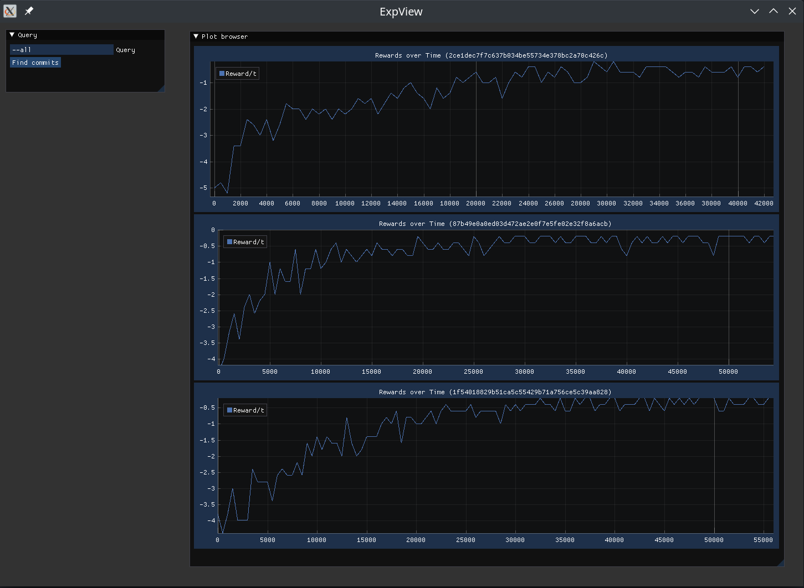

# ExpView

ExpView is a simple experiment result (plot) viewer for ML using git.

Third-party libraries used: toml++, dear imgui, implot, imgui-SFML, SFML (Simple Fast Multimedia Library). See their corresponding license files.

ExpView is licensed under the MIT license. See [LICENSE.md](./LICENSE.md).

## Build

Install the listed third-party libraries. Then from this repository run

> mkdir build && cd build

> cmake ..

> make

This should generate the ExpView executable. Tested on Linux x86_64.

## Usage

ExpView is an app that looks at a given git repository and checks for commits containing a file called expview.toml. These files contain plots that can be generated in the toml format.
The app then provides a convenient view of the plots so they can be compared. Commits can be queried with the query dialog window by provided queries in the same format accepted by the "git log" command, e.g. "--all".

## Screenshot

